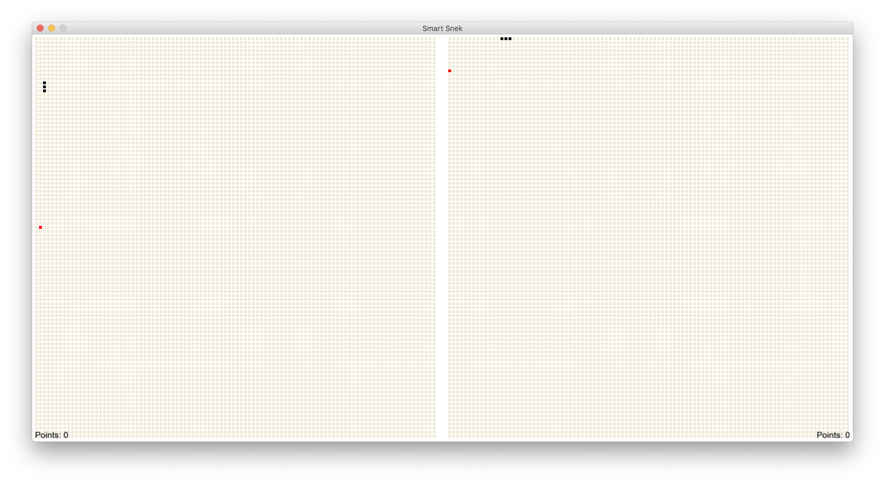

# Genetic Neural Networks Project - Decoding Nature
The following project was developed for the class
Decoding Nature in New York University Abu Dhabi in
Fall 2019 with professor Joerg Blumtritt.\
Its purpose is to explore the capabilities of Neural
Networks when used in conjunction with a Genetic
Algorithm in order to set its weights as biases.

## Technical Requirements
It runs on Python 3.7.4, with the following libraries:
  * Development of the Genetic Neural Network:
    * `neat-python` version 0.92.
    * `numpy` version 1.17.3.
  * Visual presentation and game:
    * `arcade` version 2.1.7.
    * `numpy` version 1.17.3.

The repo contains a Dockerfile that will build a Debian
container and install all the required libraries.
However, it is also possible to run the scripts in a
conda or PyEnv environment.

## Relevant Files
The files involved in training the model, called Snek
(as a reference to the [Tiny Snek](https://www.facebook.com/TinySnekComics/)
webcomic), are the following:
  * `src/neat_snek.py`, which contains the class that
  handles most of the game interactions.
  * `src/neat_train.py`, which handles the training
  using the NEAT library, a library specialized in
  training neural networks using a genetic algorithm.
  * `src/neat.config`, a file containing all the
  configuration specifics for this particular problem.

The files involved in the visual presentation and in
playing the game are:
  * `src/display.py`, which uses the Arcade library
  to create a playable game that displays the model
  on the left and a user-controlled Snek on the right.

The model is stored in `src/winner.pkl` after training,
which is afterwards called by the game.

## How to Run
To build the Docker container from the Dockerfile, use
`make docker-build`.\
To run the training of the model and then store the
winner, use `make docker-train` or `make train`.\
To run the display of the game after having trained a
Snek, use `make docker-display` or `make display`.

## Sample Picture

